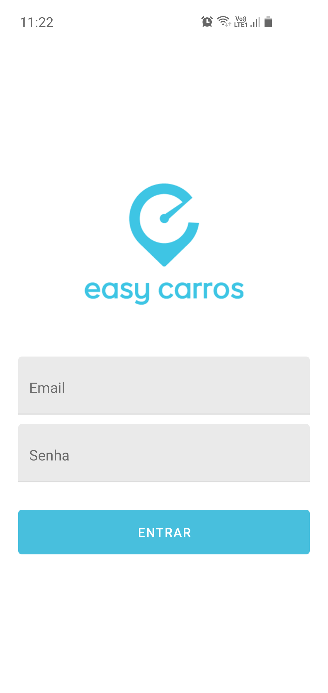
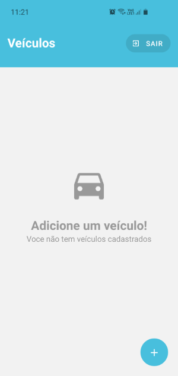
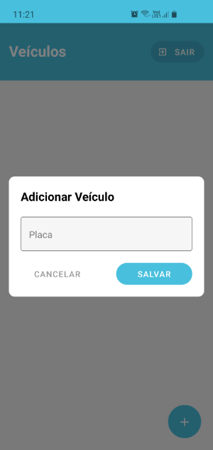

# Easy Carros v1.0.0


**Easy Carros** é a solução para acabar com burocracias na vida de quem possui um veículo, digitalizando todas a tarefas necessários na vida do carro. Como manutenção, serviços,  gestão de multas, documentos, financiamento e até a venda do seminovo.




### Instalação

Necessário ter node, yarn e Android Studio instalados na sua máquina.

> Setup para ambiente de desenvolvimento [Android](https://reactnative.dev/docs/environment-setup).
> 
> Development OS: **Windows** 
> Target OS: **Android**

```bash
cd easy_carros_app
yarn install
```


### Rodando a aplicação

> Preparando aplicação para rodar em [device físico](https://reactnative.dev/docs/running-on-device)

Para usar a api challenge da Easy Carros rodando na porta [http://localhost:8181](localhost:8181), devemos executar o comando abaixo para mapear a porta `8181` do ambiente para o device.

    adb reverse tcp:8181 tcp:8181

E então rodar a aplicação.

```bash
npx react-native run-android
```
